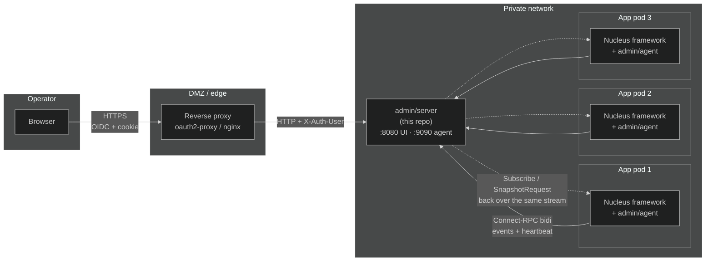

# Nucleus Admin Observability

The `admin/` tree is the new real-time observability subsystem for
Nucleus. It is split into four releasable units that talk to each other
over a single Connect-RPC contract:

```
admin/
├── proto/   Connect-RPC v1 contract (single source of truth)
├── agent/   Embedded in every framework process — ships events
├── server/  Standalone binary — fans events out, embeds the UI
└── ui/      React + Connect-Web; built into the server binary
```

Each subdirectory has its own README with the package-level invariants
and how to develop against it.

The framework's existing CRUD admin (`pkg/admin/`) — Data Studio, RBAC,
audit, sessions, system pulse — is not part of this subsystem. It
stays embedded in the framework process and continues to work
unchanged.

## Architecture



* The agent dials the admin server, never the other way around.
  Multi-endpoint failover with exponential backoff lets agents survive
  brief admin outages and rolling deploys.
* All observability traffic between agents and the admin server uses
  ONE bidi stream per agent. Events flow agent → server; subscribe /
  unsubscribe / snapshot commands flow the other direction multiplexed
  on the same connection.
* The admin server fans events out to UI subscribers without persisting
  them. Persistence is OpenTelemetry's job; this admin is for live
  visibility only.
* The web UI is the only consumer of `ControlService` (`ListNodes`,
  `StreamEvents`, `GetSnapshot`). It is served by the admin server
  binary at `/`.

## Quickstart

```bash
# 1. Generate dev certificates (one-shot).
scripts/gen-dev-certs.sh

# 2. Build the admin server binary (with the UI embedded).
make build

# 3. Run the admin server. The default flags listen on :9090 (agents)
#    and :8080 (UI/operators) without TLS — fine for development on
#    127.0.0.1.
./bin/admin-server

# 4. In another terminal, run an example app pointed at the local
#    admin server.
go run ./examples/admin-quickstart/cmd/sample-app

# 5. Open http://localhost:8080 in a browser.
```

For a production-like multi-node setup, see `examples/admin-quickstart/`.

## Configuration

The agent reads its config from the framework's `nucleus.yml`:

```yaml
state_dir: /var/lib/nucleus

admin:
  endpoints:
    - https://admin.internal:9090
  token: "${env:NUCLEUS_ADMIN_TOKEN}"
  heartbeat_interval: 10s
  drain_timeout: 2s
  metrics_addr: 127.0.0.1:9101

  # Compliance-sensitive deployments may require the agent to be
  # connected at boot. When require_connection is true the framework
  # refuses to start if no admin endpoint is reachable within
  # require_connection_timeout. Default: false (fail-open).
  require_connection: false
  require_connection_timeout: 10s

  # Optional ring buffer sizes. Defaults are sensible for typical
  # workloads.
  http_buffer_size: 256
  sql_buffer_size: 256
  session_buffer_size: 64
  custom_buffer_size: 64
```

The admin server reads its config from CLI flags (with
`NUCLEUS_ADMIN_*` env-var fallbacks). See `bin/admin-server --help`
for the full surface or `admin/server/cmd/admin-server/main.go`.

## Security model

| Surface           | Default                                                   | Production recommendation                  |
|-------------------|-----------------------------------------------------------|--------------------------------------------|
| agent ↔ server    | shared bearer token (h2c)                                 | mTLS with operator's CA                    |
| UI ↔ server       | trusted-proxy headers (`X-Auth-User` from 127.0.0.1)      | oauth2-proxy in front, OIDC, group filter  |
| server exposure   | bound to 127.0.0.1                                        | private VLAN, NetworkPolicy, no public LB |

The admin server NEVER joins the application's public load balancer.
It listens on a private interface; the only operator path to it is
through the auth-aware reverse proxy described in
`examples/admin-quickstart/`.

## Hardening checklist before production

- [ ] Generate real certificates (replace `scripts/gen-dev-certs.sh`
      output with your CA's chain).
- [ ] Set `agent_token` and rotate it via your secret-management
      system.
- [ ] Front the UI listener with oauth2-proxy or equivalent.
- [ ] Restrict `ui_trusted_proxy_cidrs` to the proxy's source range.
- [ ] Apply the K8s NetworkPolicy from `examples/admin-quickstart/k8s`
      so only agents and operators can reach the listeners.
- [ ] Decide on `require_connection`. Default fail-open is right for
      most deployments; flip to `true` only if your compliance posture
      requires it.
- [ ] Forward the admin server's `/metrics` and the agent's
      `/metrics` to your Prometheus scraper.
- [ ] Run `make ci` in CI on every change to admin/proto/**, including
      `buf breaking` against `main`.

## Lifecycle and contracts

* Proto evolution rules: `admin/proto/EVOLUTION.md`. Read this before
  ANY change to a `.proto` file.
* Wire contract: bidi `AgentService.Stream` for agents; unary +
  server-streaming `ControlService` for UIs. The TypeScript stubs
  consumed by the React UI come from the same `make proto` invocation
  that produces the Go stubs — there is no second source of truth.
* Tests: every module has its own table-driven tests; the integration
  tests under `admin/server/server_integration_test.go` and
  `admin/agent/agent_test.go` exercise the full handshake (registration,
  subscribe, event delivery, unsubscribe, goodbye, reconnect).
* Benchmarks: see `admin/BENCHMARKS.md` for hot-path cost numbers.

## What is intentionally NOT in this subsystem

- **Event persistence.** OpenTelemetry's job. The admin keeps a small
  per-kind ring buffer for replay-on-panel-open; that's it.
- **CRUD on registered models.** Lives in `pkg/admin/` (Data Studio).
  See the post-Fase-7 plan in the repo root if you want to migrate it
  to this admin.
- **Active-active admin servers.** Documented as a future extension in
  `admin/proto/EVOLUTION.md`. The current design is single-instance
  with active-passive failover via the agents' endpoint list.
- **Authentication of the UI itself.** Delegated to a reverse proxy.
  We intentionally do NOT embed an OIDC or LDAP client in the admin
  server.
